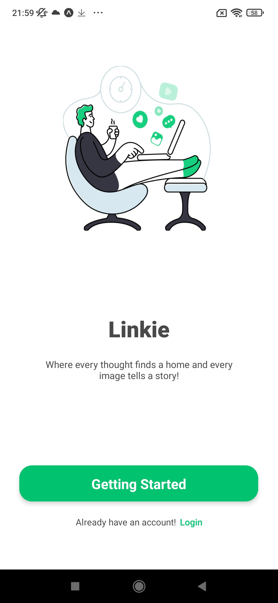
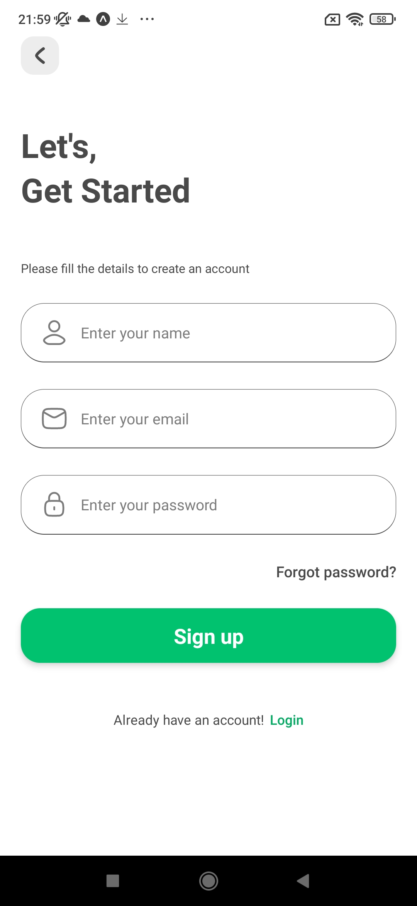
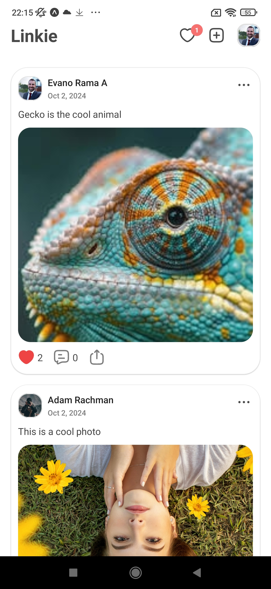
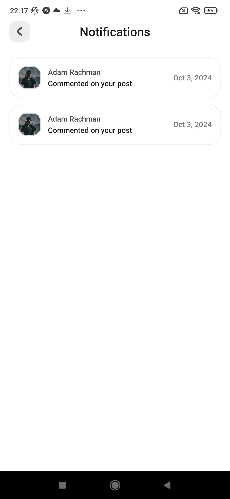
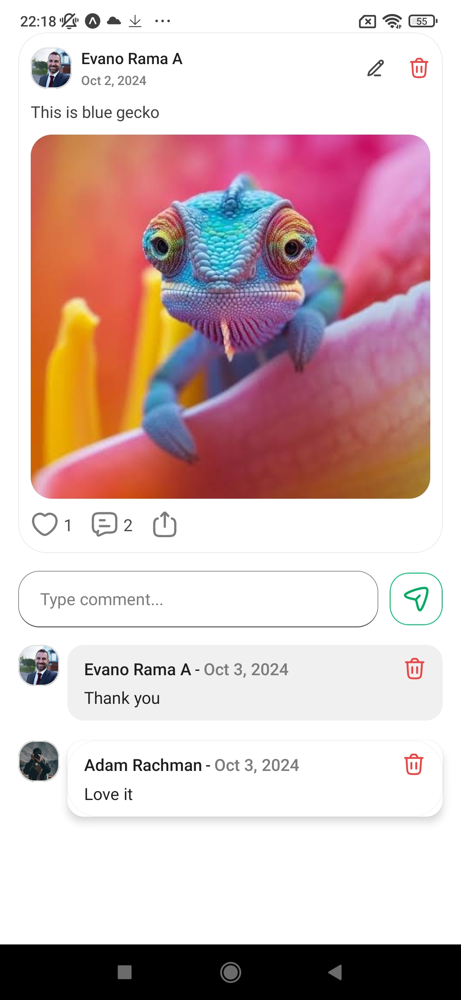
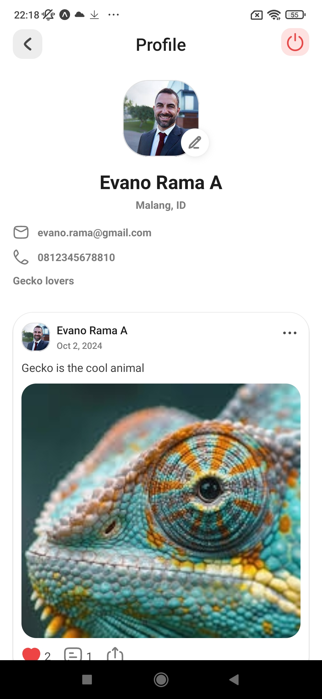

# Linkie

Linkie is a social media app built using React Native and Supabase, providing a seamless experience for posting, liking, commenting, and sharing. The app features real-time updates and supports photo and video uploads.

Thanks to _code with nomi_

## Features

-   **Post, Like, Comment, Share**: Users can create posts, like, comment, and share content.
-   **Real-time Updates**: Leveraging Supabase subscriptions, updates are reflected instantly for all users.
-   **Media Uploads**: Users can upload photos and videos, stored securely with Supabase Storage.

## Tech Stack

-   **Frontend**: React Native
-   **Backend**: Supabase (Database, Storage, Realtime)

## Screenshots

<div style="display: flex; flex-direction: row; flex: wrap; gap: 6px">
    <div>
        
    </div>
    <div>
        
    </div>
    <div>
        
    </div>
    <div>
        
    </div>
    <div>
        
    </div>
    <div>
        
    </div>
</div>

## Installation

1. Clone the repository:

    ```sh
    git clone https://github.com/devcodemada/linkie.git
    cd linkie
    ```

2. Install dependencies:

    ```
    npm install
    ```

3. Set up Supabase:

    - Create a Supabase project and get the API keys.
    - Add your Supabase URL and API key in a .env file.

4. Run the app:
    ```
    npm run android  # For Android
    npm run ios      # For iOS
    ```

## Configuration

Create a .env file in the root of the project with your Supabase credentials:

```
SUPABASE_URL=your-supabase-url
SUPABASE_ANON_KEY=your-supabase-anon-key
```

## Usage

-   **Register**: Create an account using an email and password.
-   **Post Content**: Upload photos/videos, write captions, and share with others.
-   **Like, Comment, Share**: Interact with posts in real-time.
-   **View Real-Time Updates**: Receive updates instantly when others like, comment, or share.

## License

This project is licensed under the MIT License - see the [LICENSE](LICENSE) file for details.

## Contributing

Contributions are welcome! Please feel free to submit a Pull Request.

## Contact

For any questions, feel free to reach out at [devcodemada@gmail.com].
